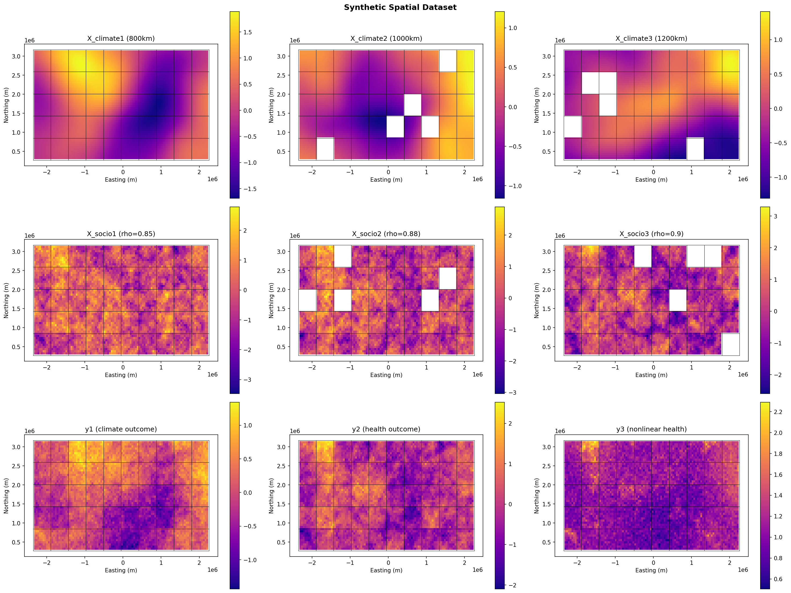

# Graph Conditional Denoising Autoencoder with Random Fourier Features for Climate Adaptation

---

This repository contains the code for the Graph Conditional Denoising Autoencoder (GCDAE) with Random Fourier Features. The model is designed as a small-scale foundation model capable of jointly handling multimodal datasets and spatial dependencies.

## Installation

```sh
# Create a conda python environment
conda create -n gcdae python=3.11

# Activate the environment
conda activate gcdae

# Install the required python packages
pip install -r requirements.txt --index-url https://download.pytorch.org/whl/cpu --extra-index-url https://pypi.org/simple
```

## Reproduce this project

```sh
# Generate the synthetic dataset
python build_datasets.py

# Train the GCDAE model and produce the embeddings
# In this script, model is trained using model.train_model()
# and embeddings are extracted and saved using model.save_checkpoints()
python create_embeddings.py

# Run the downstream evaluation
python downstream_evaluation.py

# (optional) Plot the synthetic dataset and reconstructed dataset
# Plots are stored in plot/
python plot_results.py
```

## Source File Description

- `src/synthetic_dataset_generation.py`: Source code that defines the helper functions for generating the synthetic dataset.
- `src/rbf_gnn_fm.py`: Source code that defines `GCDAE` class and the function that creates Random Fourier Features for a set of coordinates.
- `src/evaluation.py`: Source code that defines helper functions for evaluation
- `src/baseline.py`: Source code that defines baseline models including KNN, IDW, GNN, and spatial EOFs. This also includes a helper function `fit_tune_eval` that automates the training, tuning (on a set of parameters) and evaluation process.
  - The IDW method is from https://gist.github.com/Majramos/5e8985adc467b80cccb0cc22d140634e.

## Saved dataset and model description

- `data/synthetic/config.pt`: configuration used to generate the simulated datasets
- `data/synthetic/fine_regions.gpkg`: simulated fine-level grids with the following fields
  - `x`, `y`: coordinates in the projected coordinate system (EPSG:5070)
  - `y1`, `y2`, `y3`: target variables
  - `X_climate1`, `X_climate2`, `X_climate3`: climate-like features
  - `X_socio1`, `X_socio2`, `X_socio3`: sociodemographic-like features
  - `X_common`: shared spatial effect for both climate-like and sociodemographic-like features
  - `coarse_id`: group ID linking each fine-level grid to a coarse-level grid
  - `group_effect`: group effect defined at the coarse-level grid
- `data/synthetic/coarse_regions.gpkg`: simulated coarse-level grids
- `data/synthetic/edge_index.pt`: graph structure for the sociodemographic-like features
- `data/synthetic/X_climate.pt`: climate-like features (same as in `fine_regions.gpkg`)
- `data/synthetic/X_socio.pt`: sociodemographic-like features (same as in `fine_regions.gpkg`)
- `data/model/model.pt`: trained GCDAE model weights
- `data/model/embed.pt`: region embeddings where the first 256 dimensions correspond to climate-like features and the last 256 to sociodemographic-like features



## Pytest Checks

To made evaluation efficient, I've included the following programmatic checks.
- `tests/test_data.py`
  - **Reproducibility**
    - Note that a hash check is not reliable for the saved synthetic data (computed on my laptop) because of numerical precision issues. For example, the `car_graph` function uses a numerical solver for a sparse linear system (`scipy.sparse.linalg.cg`) and `matern_continuous` relies on several floating-point operations. These computations can produce slightly different results across machines with different CPU architectures.
    - Instead, I check whether the values in the saved `.pt` files are close to those in newly generated data produced with the same seed.
    - For saved spatial datasets (`.gpkg`), I also compare the geometry and relevant fields (`coarse_id`, `X_common`, `group_effect`, `X_climate1–3`, `X_socio1–3`, `y1–3`) to those in newly generated data produced with the same seed.
  - **Schema/shape validity**
    - Check that all expected datasets exist
    - Check that spatial grids, feature matrices, and edge tensors have correct shapes
- `tests/test_data_hash.py`
  - **Reproducibility**
    - To avoid the numerical issue for different machines, this script generates two synthetic datasets with the same seed during runtime in pytest and verifies that they are identical by hash.
- `tests/test_model.py`
  - **One-step training sanity**
    - Run a forward step and check the embeddings and reconstructed features have no NaNs/infs.
  - **Embedding export**
    - Check that all saved embeddings have the expected shape and consistent ordering.
- `tests/test_eval.py`
  - **Evaluation integrity**
    - Check that test labels are never used for tuning. This is done by poisoning the test labels with extreme values and confirming that `fit_tune_eval` returns the same predictions, since any leakage would cause the results to change.

To run these programmatic checks, run
```sh
pytest -v
```
